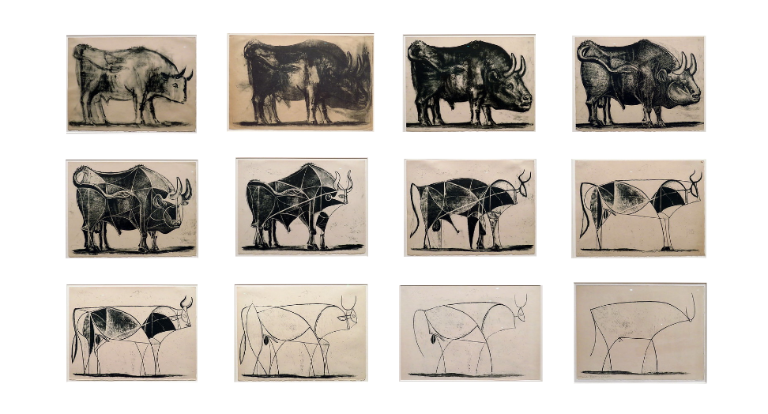
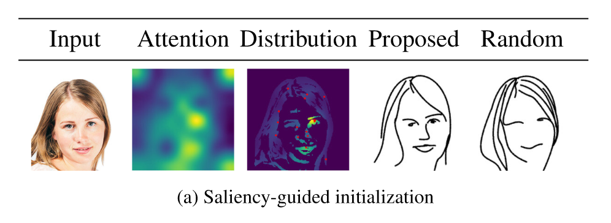
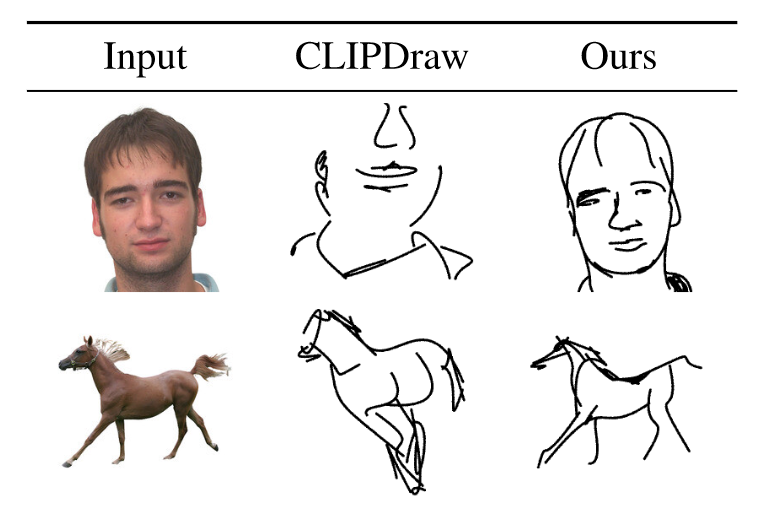

# 前言
CLIP作为多模态对比学习里程碑式工作，在创新性，有效性和领域性三个方面都拉满了。现在探讨在CLIP之后，各个领域是如何利用CLIP去提升当前领域的性能，以及如何利用CLIP信息整合的能力在多模态领域做大做强。

# 1. 语义分割
## 1.1 Lseg
LSeg是一种基于语言驱动的语义分割模型，通过将像素嵌入和相应的文本嵌入对齐，帮助模型学习多模态的特征表示。本质上，LSeg是基于CLIP做语义分割任务的模型，其零样本的表现如下图所示：
  
LSeg整体流程如下图所示，形式上和CLIP几乎一致，只是多了下游任务的过程。首先将图像和文本分别输入各自编码器中，图像的编码器是DPT模型，由ViT和decoder模块组成，decoder的目的是将降维的特征scale up，匹配语义分割任务。接着将具有相同通道大小的图像编码和文本编码相乘，将结果输入到空间正则化块得到分割结果。

LSeg本质上还是和CLIP有很大区别的，首先其文本编码器就是采用的CLIP中的文本编码器，并且冻住参数不让其更新。这是因为分割领域的数据集规模都很小，如果进行微调，很容易造成训练不稳定，将模型带跑偏，不如就用原始的优良的CLIP文本编码器参数。其次，这里并没有选择无监督对比学习的方式训练，而是采用有监督的ground-truth，通过交叉熵计算损失，这里的思想就是将文本语义信息融入到图像中，通过有监督的方式将文本和图像编码对齐，这种方式最大的缺陷在于并没有真正学习到文本的语义信息。

实验上，模型的差距还是非常明显的。虽然LSeg在zero-shot上取得了最好的结果，但是缺乏对比意义，因为ViT-L/16要比ResNet101大得多，此外，LSeg远远不如one-shot的结果，可见分割领域在语言驱动上还有很大的进步空间。
## 1.2 GroupViT
GroupViT来自CVPR2022，它通过结合ViT和对比学习，采用分组机制俩处理CV中语义分割问题，其整体流程如下：

图像方面，首先将图像分割成图像块输入到线性层中通过映射得到196×384的 embedding，接着将图像token嵌入和group token一起输入到ViT块中，这里group token相当于聚类中心，维度为64×384，用于代表整个图像的特征。经过6层Transformer块后，将输出输入到Grouping块中，这可以认为是聚类的过程，如图b所示。g和s的维度分别为64×384和196×384，二者通过线性映射相乘得到相似度矩阵，并利用该相似度矩阵帮助原始的图像块进行聚类中心的分配，为了能够进行端到端的训练，作者设计了gumbel softmax让参数可导。经过聚类操作后，得到64×384的输出，为了进一步聚类，作者将该输出和7×384的token块再次输入到Transformer块和Grouping块中，最终得到8×384的输出，即整个图像可以由8个聚类中心表示。接下来的部分就和CLIP异曲同工了，作者将得到的8×384的特征经过平均池化层得到全局的表征，和文本编码结果进行对比学习得到loss，从而进行训练学习。
GroupViT在ViT基础上并没有加太多复杂的模块，因此具有良好的可扩展性。作者在2900万个文本对上进行训练，理论上说，如果GroupViT在CLIP的4亿条文本对上进行训练，会带来进一步性能上的提升。  
CLIP最令人惊叹的是其零样本的能力，因此GroupViT也设计了零样本的实验，用于测试GroupViT的迁移能力。其过程如下：

将图像和添加prompt的文本分别输入到各自的编码器中，然后计算文本和8个聚类中心的相似度，这里的局限性在于如果图像中的类别超过8个，那么就无法准确识别所有类别，当然这里聚类中心的数目是可调节的。

那么grouping token是否在工作呢？作者分别对stage1和stage2中的部分grouping token进行可视化，如上图所示。可以看到，在stage中，grouping token对图像中较小的部分进行分类，如眼睛，手肘，在stage2中，grouping token可以分类身体、脸这些占据图像更大内容的物体，可见grouping token确实起到了聚类作用，并且随着聚类中心的减少，类别会更加抽象。

实验上，GroupViT性能不仅最好，还能做零样本任务，但是和有监督学习的模型相比还是差距明显。作者发现，grouping token的分割其实做得很好，做的不好的地方在于分类部分，如果仅仅是考虑分割，那么这种无监督的方式是可以达到监督效果的。
# 2. 目标检测
# 2.1. ViLD
ViLD来自于ICLR2022，但是这篇工作在CLIP出来才两个月时间就已经挂到了arXiv上，可谓是内卷之王。这篇工作的主要内容，可以由下面这张图直接概括：

图中是三个动物玩具，但是基础类只有玩具这一类，作者提出，能否设计出一种目标检测器，除了识别训练中存在的标签类别，还能够扩展词表检测新的类别。这就是本文的目标，训练一个开放词汇对象检测器，仅使用基本类别中的检测注释来检测文本输入描述的任何新类别中的对象。

上图是ViLD的结构以及和之前模型的对比。（a）中的head是普通的两级检测器分类头，如Mask R-CNN。输入N个proposals得到的N个位置表征进行分类。proposals是指算法生成的一组可能包含目标物体的候选区域或区域建议。ViLD模型总体上由ViLD-text和ViLD-image组成，ViLD-text用固定的文本嵌入和可学习的背景嵌入途欢了原先的分类器，CLIP的应用体现在ViLD-image部分，CLIP模型作为teacher模型，ViLD作为student模型，将二者的输出进行知识蒸馏，让ViLD的输出尽可能靠近CLIP的输出，采用L1损失来更新参数。
ViLD的完整结构如（d）所示，N+M个proposals输入到Head中得到各自的表征后剥离开来，N个和ground-truth进行比较，通过计算交叉熵损失更新参数，M个和CLIP得到的表征进行知识蒸馏，采用L1损失来更新参数。

绿色是原始类别，蓝色是新类别。首先原始类别和新类别通过构造template输入到文本编码器中得到文本表征，以便训练和推理时使用。训练阶段，图像输入到backbone和RPN得到proposals，proposals分别输入到CLIP和RoIAlign中得到各自的表征，二者的表征进行知识蒸馏，通过L1损失进行学习，此外，后者表征和对应的文本编码计算交叉熵损失，从而进行梯度的反向传输。推理阶段，将图像经过Backbone+RPN和RoIAlign得到proposals的表征后，和所有的文本表征进行相似度计算，从而得到判别结果。

由于本篇工作作者强调的是模型面对新类别的预测能力，因此主要关注模型的零样本结果，即APr结果。可以看到ViLD大幅超过之前的基线模型。并且ViLD迁移到其它未见的数据集性能表现也很良好，结果如下：

## 2.2 GLIP
GLIP可以说就是目标检测领域的CLIP，CLIP受益于4亿对图文数据，可以预训练得到很好的模型，但是目标检测领域并没有如此丰富的数据集，因此GLIP利用自我训练的方式，即半监督学习，根据提供的文本prompt生成大量的带有锚框的数据，从而学习到丰富的图文表征。GLIP具有强大的零样本能力，在COCO数据集上，zero-shot可以达到49.8，超过了不少监督baseline，经过微调后更能达到60以上的AP。下图是GLIP的零样本迁移表现：

那么模型是如何做半监督学习的呢？所采用的数据集如下所示：

首先作者收集了物体检测数据集，但是其规模显然不够，于是作者又收集了Grounding和Caption数据集，Grounding数据集是文本描述和其对应内容锚框的数据集，而Caption数据集是图文数据集。前者和检测数据集类似，可以直接用于模型预训练，后者需要模型生成对应的锚框，再进行训练，即自训练过程。通过这样的操作就可以得到大规模丰富的数据集了。

上图是GLIP整体的流程图，形式上和CLIP很像，将图像和其对应的文本输入到各自的编码器中得到表征，由于是监督训练，所以输出的锚框和文本通过计算相似度和ground-truth对比，计算Alignment损失从而梯度反传。中间的Fusion即Cross Attention，可以让文本和图像之间的联系更强。此外还有一个关键是定位损失，帮助模型训练更好的锚框，从而进行半监督学习。

实验结果如上图所示，可见GLIP在零样本上取得了很好的结果。
## 2.3 CLIPv2
受到GLIP中多任务数据集进行半监督训练的影响，GLIPv2将多种任务统一起来，既可以做对象检测，实例分割等定位任务，又可以做VQA，图文对的理解任务，如下图所示：

GLIPv2实现了定位和理解任务之间的互惠互利，单个GLIPv2模型有我在各种定位和理解任务上接近SOTA。该模型还展示了在开放词表上强大的零样本和few-shot性能，并且在VL理解任务上有着卓越的能力。
# 3. 图像生成
## 3.1 CLIPasso

CLIPasso这篇工作是会议SIGGRAPH最佳论文，它将物体的图像抽象成不同程度的草图，同时保留其关键的视觉特征。即使是非常少的表示，人们也能够识别出描绘主题的语义和结构。

上图是毕加索名画“一头公牛”，表现的就是对原始画像不断抽象的过程，要想实现这样的模型，就需要收集相应的数据集进行训练，常见的数据集如下图所示。但是现有数据集的抽象都是固定好的，这会限制抽象出的形式和风格，违背了图像生成的初衷。

如何摆脱对有监督训练集的依赖，并抽取出更好的图像语义？作者自然而然就想到了CLIP。

主体方法如上图所示，首先根据原始图像生成采样范围，接着采样点生成贝兹曲线，一条贝兹曲线是空间上多个二维的点控制的曲线，点的个数可以调整。模型训练的过程本质上是更改点的位置，从而改变曲线的形状，得到想要的简笔画。具体来说，将采样得到的n个笔画输入到光栅化器Rasterizer，从而得到图像的简笔画，接下来就是工作的创新点，作者采用了CLIP模型，将原始图像和简笔画输入到CLIP中得到的特征尽可能相似，计算损失，让模型学习到图像的语义信息。但是光有语义信息，位置不匹配也会导致生成的简笔画和原始图像不一致。因此作者又设计了另外一个几何损失函数，计算原始图像和简笔画在模型前几层特征的相似性，因为模型的前几层包含更多的几何特征信息。通过语义损失和几何损失的加持，就可以保证训练好的模型生成的简笔画无论在语义信息和几何位置上都和原始图像尽可能一致。
本文工作另一个创新点就在于点初始化saliency部分，因为不同的初始化结果会导致简笔画差异很大。具体来说，作者将原始图像输入到训练好的ViT中，把最后一层多头注意力取加权平均，做成saliency MAP，让点在显著的区域采样。下图是不同初始化生成的结果，可以看到本文的初始化得到的简笔画效果显然更好。

CLIPasso效率高，性能好，成本低，在一张V100上只需要6分钟就能够完成2000轮迭代，迭代100轮的时候就可以看出模型的效果如何。

CLIPasso可以为不常见的物体生成简笔画，这是之前的模型所不能做到的。比如下面的结果：

此外，CLIPasso另一个卖点在于可以通过控制笔画的个数来控制生成简笔画抽象的程度。当笔画数越少，生成的简笔画相应就会更抽象。
实验部分，作者将CLIPasso和其它模型进行了生成简笔画结果的对比如下：

可以看到对于任意物体，CLIPasso生成的简笔画都更能体现原始图像的特征。
当然，CLIPasso也有如下几点局限性：
- 有背景的图像会降低模型的性能，本文采用了自动掩码的方法，将目标从原图中抠出来再进行简笔画的生成，但是这样two step的过程显然不够便捷，一个可行的方向是设计一个损失函数让模型学习不被背景干扰。
- 简笔画的笔画是同时生成的，这和真实场景下的素描不同，如果能够一笔一笔生成，生成的简笔画可能更合理，更具艺术性。
- 笔画的个数必须提前确定，但是不同图像在相同抽象程度所需笔画数量不同，如果能够将其变为可学习的参数，那么就可以规定抽象级别对不同的图像执行简笔画任务了。
